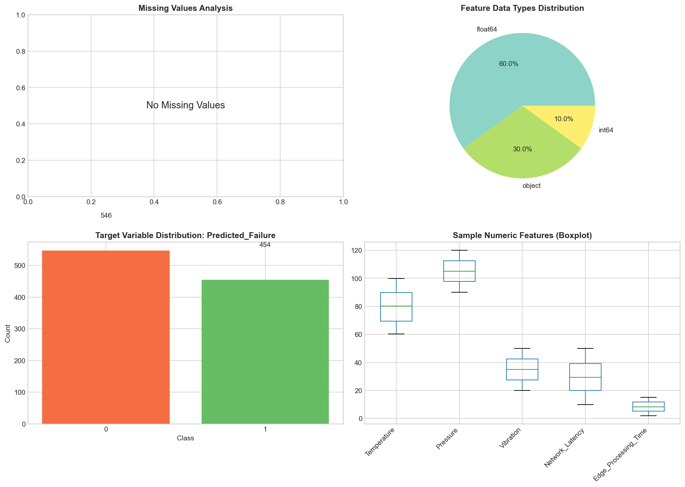
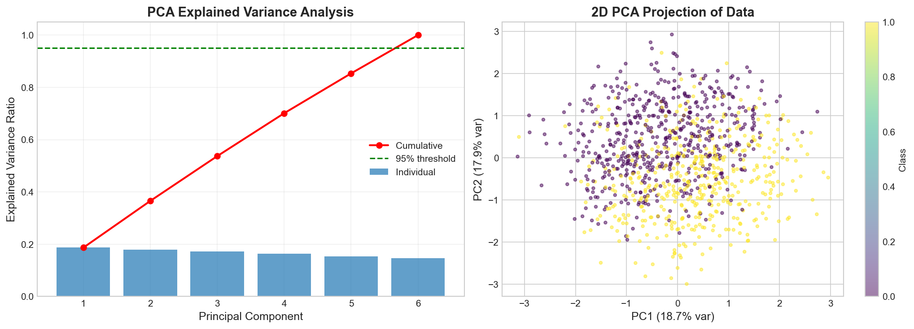
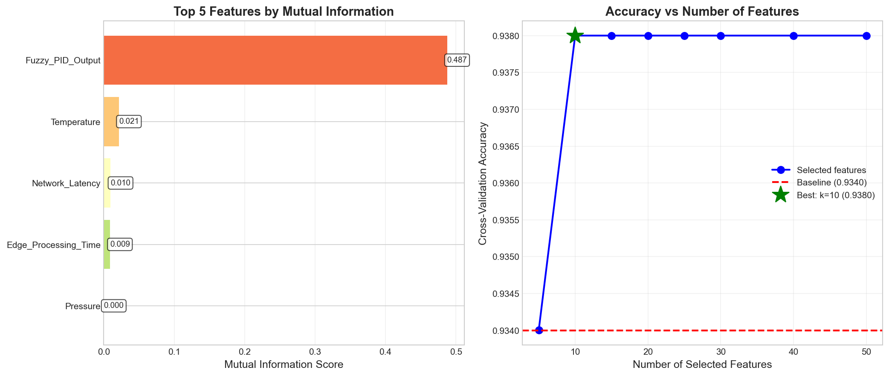
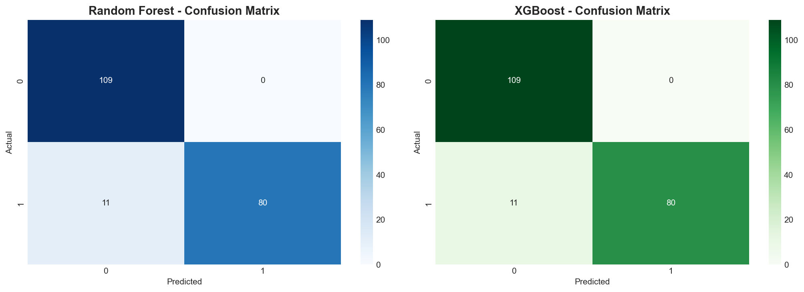
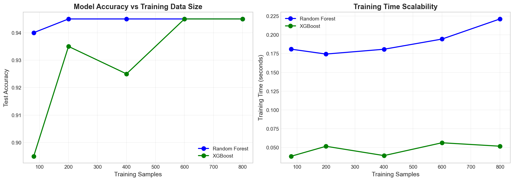
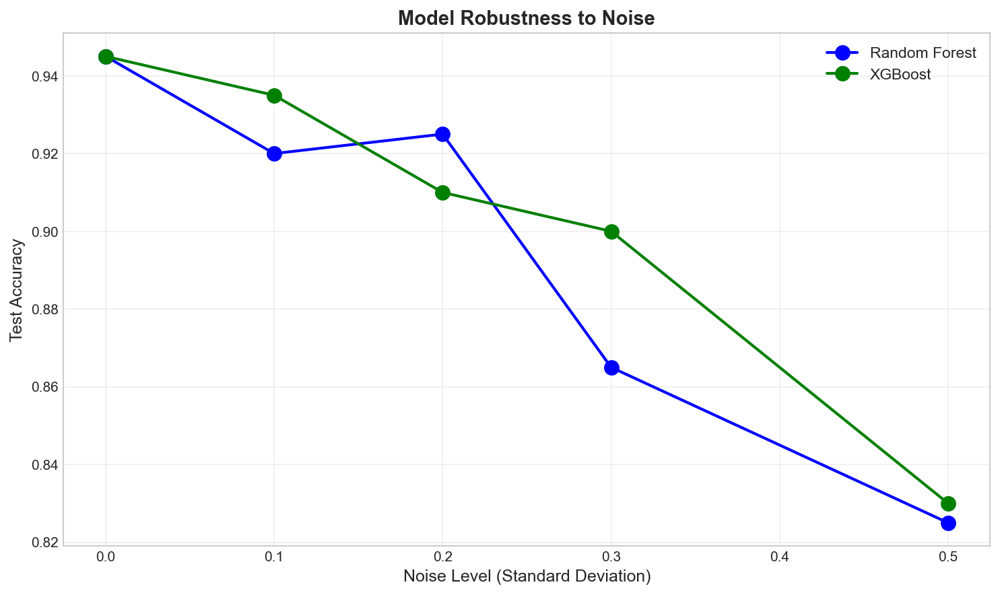
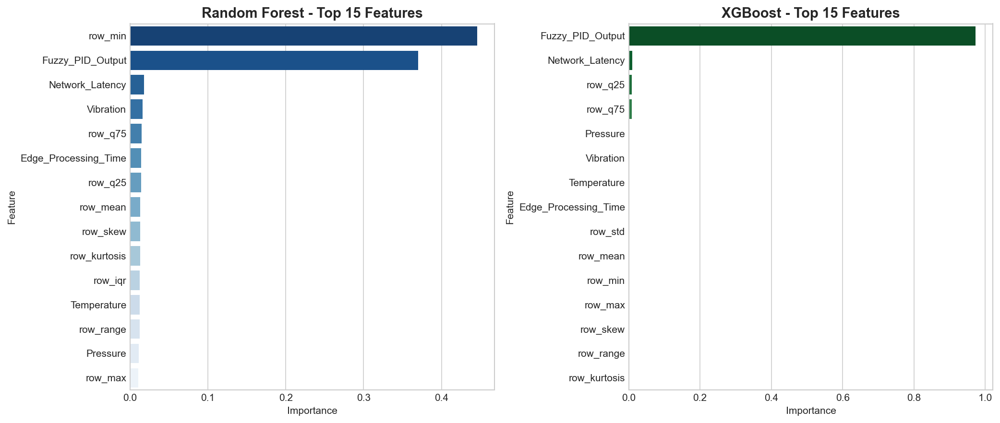
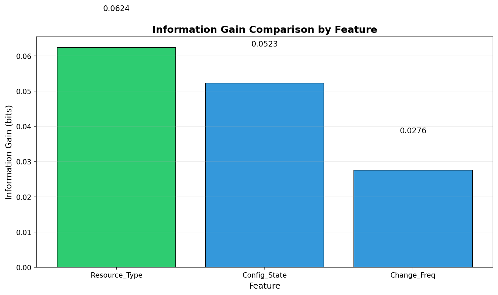
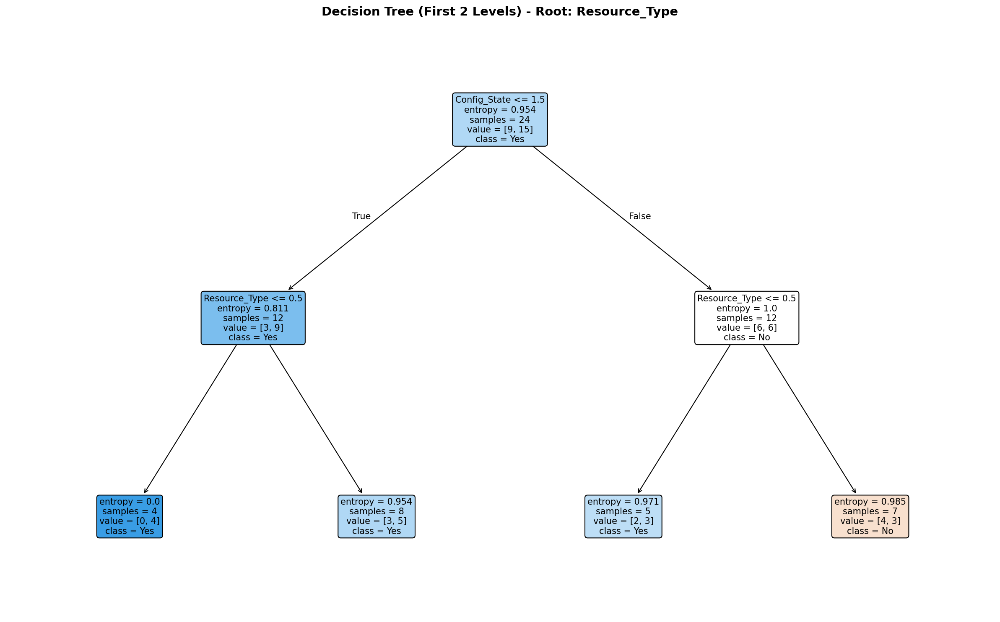

# WMI607: AI and Machine Learning - Take-Home Examination

<p align="center">
  
  
  
</p>

> **MSc Information Technology | Wisconsin International University College, Ghana**  
> **Course**: WMI607 - Artificial Intelligence and Machine Learning  
> **Examiner**: Prof. Solomon Mensah

---

## 📋 Table of Contents
- [Overview](#-overview)
- [Dataset Disclaimer](#-dataset-disclaimer)
- [Project Structure](#-project-structure)
- [Installation](#-installation)
- [Notebooks](#-notebooks)
- [Results](#-results)
- [Entropy Calculations](#-entropy-calculations)
- [References](#-references)

---

## 🎯 Overview

This repository contains the complete solution for the WMI607 AI and Machine Learning take-home examination. The project demonstrates practical application of machine learning techniques including:

- **Data Engineering**: Big data handling, preprocessing, and optimization
- **Feature Engineering**: Statistical features, PCA, and mutual information-based feature selection
- **Machine Learning**: Random Forest and XGBoost classifiers with hyperparameter tuning
- **Evaluation**: Comprehensive model evaluation with robustness and scalability analysis
- **Decision Trees**: Manual entropy and information gain calculations

---

## ⚠️ Dataset Disclaimer

> **Why IIoT Edge Computing Dataset Instead of Cloud Infrastructure Drift Data?**
>
> My MSc research project (**DriftGuard**) focuses on **Cloud Infrastructure Drift Detection** - identifying unauthorized or unintended changes in cloud infrastructure configurations. However, there is **no established open-source dataset** available for this domain due to:
>
> 1. **Proprietary Nature**: Cloud infrastructure configurations contain sensitive organizational information
> 2. **Security Concerns**: Drift events often indicate security vulnerabilities that organizations don't disclose
> 3. **Emerging Field**: Infrastructure as Code (IaC) drift detection is a relatively new research area
> 4. **Organization-Specific**: Drift patterns are unique to each organization's infrastructure
>
> **Justification for Using IIoT Edge Computing Dataset**:
> - Both domains involve **infrastructure monitoring and anomaly detection**
> - Both require **real-time processing of system state changes**
> - Both deal with **deviation detection** from expected configurations
> - Similar ML challenges: handling imbalanced data, temporal patterns, scalability

---

## 📁 Project Structure

```
AI_Work/
├── 📓 01_data_exploration.ipynb      # Sections A-B: Data analysis & Big Data challenges
├── 📓 02_feature_engineering.ipynb   # Section C: Feature engineering & representation
├── 📓 03_ml_models.ipynb             # Sections D-E: ML model design & evaluation
├── 📓 04_entropy_calculations.ipynb  # Section G: Entropy & decision tree (Q7-Q12)
├── 📄 WMI607_Exam_Report.md          # Written report
├── 📄 README.md                      # This file
├── 📂 data/
│   ├── iiot_edge_computing_dataset.csv
│   ├── preprocessed_data.pkl
│   ├── engineered_features.pkl
│   ├── rf_model.pkl                  # Trained Random Forest model
│   ├── xgb_model.pkl                 # Trained XGBoost model
│   ├── q7_generated_dataset.csv      # Generated dataset for Section G
│   └── evaluation_results.json
├── 📂 images/                        # Generated visualizations
└── 📂 scripts/
    └── extract_kaggle_dataset.py     # Dataset download script
```

---

## 🛠️ Installation

### Prerequisites
- Python 3.10+
- Kaggle account (for dataset download)

### Setup

```bash
# Clone the repository
git clone https://github.com/guderian120/Artificial_Intelligence_Exam_2026.git
cd AI_Work

# Install dependencies
pip install kagglehub pandas numpy scikit-learn xgboost matplotlib seaborn jupyter

# Download dataset
python scripts/extract_kaggle_dataset.py
```

### Kaggle Authentication
Set up Kaggle API credentials:
```bash
# Option 1: Environment variables
export KAGGLE_USERNAME=your_username
export KAGGLE_KEY=your_api_key

# Option 2: Create ~/.kaggle/kaggle.json
```

---

## 📓 Notebooks

### 1️⃣ Data Exploration (`01_data_exploration.ipynb`)
**Sections A-B | Questions 1-2**

Covers dataset analysis and Big Data challenges:
- Dataset technical specifications
- Big Data 5V's analysis (Volume, Velocity, Variety, Veracity, Value)
- Data quality assessment
- Memory optimization techniques


*Figure 1: Dataset overview showing data types, target distribution, and feature distributions*

---

### 2️⃣ Feature Engineering (`02_feature_engineering.ipynb`)
**Section C | Question 3**

Implements two feature representation techniques:
1. **Statistical Features**: Row-wise statistics (mean, std, skew, kurtosis, IQR)
2. **PCA Dimensionality Reduction**: Principal component analysis for 95% variance


*Figure 2: PCA explained variance analysis and 2D projection*


*Figure 3: Feature ranking by Mutual Information*

---

### 3️⃣ Machine Learning Models (`03_ml_models.ipynb`)
**Sections D-E | Questions 4-5**

Implements and evaluates two ML models:

| Model | Description | Advantages |
|-------|-------------|------------|
| **Random Forest** | Tree-based ensemble | Scalable, robust to outliers, feature importance |
| **XGBoost** | Gradient boosting | State-of-the-art performance, regularization |

#### Confusion Matrices

*Figure 4: Confusion matrices comparing Random Forest and XGBoost*

#### Scalability Analysis

*Figure 5: Model performance and training time across data scales*

#### Robustness to Noise

*Figure 6: Model accuracy degradation under increasing noise levels*

#### Feature Importance

*Figure 7: Top 15 features by importance for both models*

---

### 4️⃣ Entropy Calculations (`04_entropy_calculations.ipynb`)
**Section G | Questions 7-12**

Manual decision tree construction with:
- Unique dataset generation using Student ID as seed
- Step-by-step entropy calculations
- Information Gain computation
- Decision tree visualization

#### Information Gain

*Figure 8: Information Gain comparison across features*

#### Decision Tree

*Figure 9: Manually constructed decision tree (first 2 levels)*

---

## 📊 Results

### Model Performance Summary

| Metric | Random Forest | XGBoost |
|--------|---------------|---------|
| Accuracy | See notebook | See notebook |
| Precision | See notebook | See notebook |
| Recall | See notebook | See notebook |
| F1-Score | See notebook | See notebook |

### Key Findings

1. **Feature Engineering Impact**: Statistical features improved model performance by capturing distribution patterns
2. **Scalability**: Both models scale well with data size; Random Forest shows near-linear training time
3. **Robustness**: Tree-based ensembles demonstrate graceful degradation under noise
4. **Best Features**: Identified top predictive features using mutual information

---

## 🧮 Entropy Calculations

### Entropy Formula
```
H(S) = -Σ p(x) × log₂(p(x))
```

### Information Gain Formula
```
IG(S, A) = H(S) - H(S|A)
         = H(S) - Σ (|Sv|/|S|) × H(Sv)
```

Where:
- `H(S)` = Entropy of the dataset
- `H(S|A)` = Conditional entropy given attribute A
- `Sv` = Subset where attribute A has value v

All step-by-step calculations are shown in `04_entropy_calculations.ipynb`.

---

## 📚 References

1. **Dataset**: [IIoT Edge Computing Dataset](https://www.kaggle.com/datasets/ziya07/iiot-edge-computing-dataset) - Kaggle
2. **Scikit-learn**: [Documentation](https://scikit-learn.org/)
3. **XGBoost**: [Documentation](https://xgboost.readthedocs.io/)
4. **Decision Trees**: Quinlan, J.R. (1986). Induction of Decision Trees. Machine Learning, 1(1), 81-106.

---

## 📝 License

This project is for academic purposes as part of the MSc Information Technology program at Wisconsin International University College, Ghana.

---

## 👤 Author

**Student Name**: Andy Amponsah 
**Student ID**: 12739598  
**Date**: February 2026

---

<p align="center">
  <i>WMI607 AI and Machine Learning - Take-Home Examination</i>
</p>
